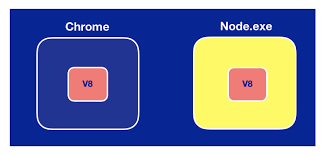

JavaScript was originally design to run only in browsers.So, every browser has "**javaScript engine**" that can execute javaScript code.

Now,The Engineer '**Brain Doll**' took 'open source javascript engine in chrome', embedded it inside a C++  program and called that program "**Node**".

>So, Node is a C++ program that includes Google's V8 javaScript engine

With this we can run javaScript code outside of a browser, we can now simply pass js code to '**Node**' for execution; that means now  we can use javaScript to built backend applications as well.

>In short, the javascript can be run inside browser and/or inside Node(which is a runtime environment)

Both Chrome and Node share the same javascript engine,but they provide different runtime environmentd for javascript.

We often use Node to build backend services, also called [API](https://www.redhat.com/en/topics/api/what-are-application-programming-interfaces) ( These are the services that power our client application)

These client apps are simply what the user sees and interect with.They're just a surface.They need to talk to some services sitting on the server or in the cloud to store data, send emails, push notifications, key workflows and so on.

>Node is ideal for building highly-scable, data-intensive and real-time backend sevices that power out client applications.

## Why Node.js ?

Now, why do we need Node when we have Django, ASP.NET, Rails, Spring etc.
Here are few of the reasons:

- Great for prototyping and agile development.
- Superfast and Highly Scalable.
- Javascript everywhere.(i.e both on front and backend we'll have JavaScript)
- Cleaner and more consistent Codebase.
- Large ecosystem of open-source library.
- It is used in production by large companies such as PayPal, Uber, Netflix, Walmart and so on.
  

#### Case Study

One of the case study says that at PayPal, they rebuilt one of their java & Spring based application using Node.js and found that:

- the Node application was built twice as fast with fewer people
- 33% fewer lines of code
- 40% fewer files
- 2x request/sec
- 35% fast response time

##How Node works?

Node applications are highly-scalable, and this is because of the non-blocking or asynchronous nature of **Node**.

#### Non-blocking or asynchronous Architecture

Imagine you go to restaurant.A waiter comes to your table, takes your order and gives it to the kitchen .Then they move onto serve another table while the chef is preparing your meal.
So, the same person can serve many different tables.They don't have to wait for the chef to cook on meal before they serve another table.This is what we call **non-blocking** or **asynchronous** architecture. 

This is how Node appications work.The *waiter* is like *thread* allocated to handle a request.So, a single thread is used to handle multiple requests.

#### Blocking or Synchronous Architecture

In contrast to non-blocking or asynchronous architecture, we have blocking or synchronous architecture.

Imagine you go to another restaurant and  in this restaurant a waiter is allocated to you.They take your order, and give it to the kitchen, now they are sitting in the kitchen waiting for the chef to prepare your meal.At this time they are not doing anything esle; they're just waiting. They're not going to take an order from another table until your meal is ready.This is what we call **blocking** or **synchronous** architecture.

 That's how applications built with framework like ASP.NET or Rail work out of the box. Ofcourse we can add asynchronous behaviour in ASP.NET but that's additional work;In contrast,*Node applications are asynchronous by default*.So, you don't need to do anything extra.

## Conclusion
- Node is *NOT* a programming language.
- Node is *NOT* a framework.
- Node is a runtime environment for executing javaScript Code.
- Node is ideal for builting highly scalable,data-intensive and real-time apps.
- Node is used by large companies like PayPal, Uber, Netflix, Walmart and so on.
- Node applications are asynchronous by default.
  

